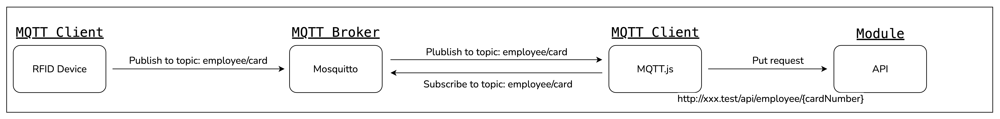

## Summer Internship

My initial foray into the company was with a summer internship. Another inter and I were tasked with creating a simple
web application that would be used as a sign-in board for the office. The application was to utilize RFID hardware that
the company is producing. The software stack was PHP and more specifically the laravel framework, using
[Jetstream](https://jetstream.laravel.com/2.x/introduction.html) to handle login and registration. For the templating
engine, we used [Inertia](https://inertiajs.com/) and [Vue](https://vuejs.org/).

The purpose of the application was to allow the company to know for health and safety purposes, who was in the office at
a given time. It was a requirement that it had a user interface, and that some consideration was given to other users of
the system such as Fire Wardens.

As the stack suggested was new to me, I followed a tutorials at [laracasts](https://laracasts.com), specifically
[Laravel 8 from scratch](https://laracasts.com/series/laravel-8-from-scratch)
and [Build Modern Laravel Apps using Inertia.js](https://laracasts.com/series/build-modern-laravel-apps-using-inertia-js)
. This took me from having no understanding of the framework, to having 2 weeks of learning and having built 2
applications. While these applications were not intended to be used in production, they were a good learning experience.

Although not a specific requirement of the project, we were also encouraged to look into the use of Test Driven
Development (TDD)and modular development.

Modularization was a key part of the project. Modules (or packages in php) are managed by
composer. [Composer](https://getcomposer.org/) is a package dependency manager for PHP, similar to npm in Node.js or
Nuget in .NET. By creating the key parts of the application in a package, I learned to manage dependencies and to use
the package manager.

Modularization also allowed me to learn about testing. I was able to learn about the testing
framework [PHPUnit](https://phpunit.de/). This did create problems though, as classes in the parent application where
the package were developing could not be accessed. This was resolved by creating stubs and mock objects, to mimic the
classes in the parent application without implementing them.

To gain an understanding of the hardware requirements, we met with members of the hardware team. Their solution for
sending and receiving messages was to use the MQTT protocol. [MQTT](https://www.mqtt.org/) is a protocol for publishing
and subscribing, intended to be used for IoT applications. The MQTT protocol is a lightweight and efficient, which is
beneficial for lowering power and memory consumption of the RFID device. It works via a 'publish and subscribe' model,
where clients can publish messages to topics, and other clients can subscribe to those topics. A broker mediates the
messages between the clients, in a similar way to a server. I found a book on the topic,
[MQTT Essentials - A Lightweight IoT Protocol](https://www.packtpub.com/mqtt-essentials-a-lightweight-iot-protocol/book)
, which was very helpful in gaining a better understanding of the protocol, including different types of software
solutions for the parts of the protocol.

Below is a diagram showing the MQTT protocol implementation that we came up with. [Mosquitto](https://mosquitto.org/)
was selected as the broker, as it was the most popular and easy to
install. [MQTT.js](https://www.npmjs.com/package/mqtt) was used to create the client. The client would subscribe to a
topic, and on receiving a message, a put request would be sent to an API endpoint. The API would the process the request
and update the status of an employee in the database.

In the end, the project taught me a lot about

* PHP
* Laravel
* MQTT
* Test Driven Development
* Modular Development

I enjoyed the internship and was keen to learn more about the technologies that I had not used before. Following a
summer internship at SnapIT, I enquired the company about the possibility of working on a project for my capstone
project at NMIT. They were very interested in retaining me within the company, and I have chosen to do complete a work
based project with them.

## Project

The project that I have proposed is somewhat of a follow on from the internship. The company is interested to move away
from Monolithic development, and instead use a combination of Microservices and Modular development. They also want to
ensure that modules are well-designed before coding beings, and that the modules are well tested before they are
released.

I have made my project proposal to the NMIT project committee based around these areas of work within the company. I
will be drawing on my academic experience with systems analysis and design, as well as my programming experience. My
project meets the needs of the business, as they are looking to develop strategies and systems to improve the
modularization of the software that they develop, and to ensure that the software developed is well tested, using Test
Driven Development.

During the week I have been gathering research on Test Driven Development and Modular software development. While there
is a plethora of resources on Test Driven Development, I could find little about modular development. That was, until I
stumbled upon the article by Martin Fowler on [Microservices](https://martinfowler.com/articles/microservices.html) and
[Laravel Package Development](https://laravelpackage.com/).
